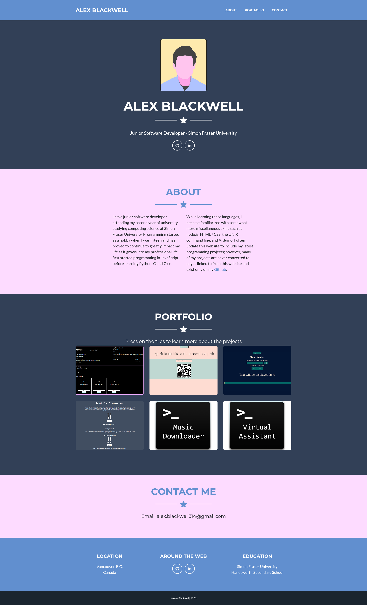

# Personal Website

## Table of contents
* [Overview](#overview)
* [Screenshots](#screenshots)
* [Technologies](#technologies)

## Overview
[Personal Website](https://alex0blackwell.github.io/)  
This is my personal Website displaying projects and information about myself. Many of my projects are only on my Github but some projects are displayed on my website. The website also includes information about my self, links to places I'm found around the web, and the option to self me Emails.

## Screenshots

> Screenshot of the website

## Technologies
- **JavaScript**
- **HTML5 / CSS3, Sass**
- **Bootstrap 4.3**
- **Jquery 3.5**
- **Pageclip**
  - For processing forms on Github's static hosting

## License
Liscensed under the [MIT](LICENSE) license.
